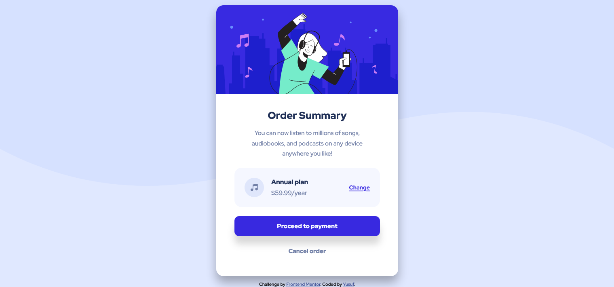

# Frontend Mentor - Order summary card solution

This is a solution to the [Order summary card challenge on Frontend Mentor](https://www.frontendmentor.io/challenges/order-summary-component-QlPmajDUj). Frontend Mentor challenges help you improve your coding skills by building realistic projects.

## Table of contents

- [Overview](#overview)
  - [The challenge](#the-challenge)
  - [Screenshot](#screenshot)
  - [Links](#links)
- [My process](#my-process)
  - [Built with](#built-with)
  - [What I learned](#what-i-learned)
  - [Continued development](#continued-development)
- [Author](#author)

## Overview

### The challenge

I have taken on a challenge from Frontend Mentor to create an Order Summary component. This will be created using HTML & CSS. I have been provided a preview image of the summary card and my task is to re-create the design of the component and ensure that it is mobile responsive.

### Screenshots

Below are screenshots of the summary card component in desktop & mobile view, using firefox's developer tool


                                           

### Links

- URL of Summary card solution: (https://summarycard-yusuf.netlify.app/)

## My process

### Built with

- Semantic HTML5 markup
- CSS custom properties
- Flexbox
- Desktop-first workflow

### What I learned

Use this section to recap over some of your major learnings while working through this project. Writing these out and providing code samples of areas you want to highlight is a great way to reinforce your own knowledge.

This task enabled me to reinforce my HTML & CSS knowledge. I have made use of a HTML5 semantic element, which I believe is good practise as they can provide the meaning & purpose of an element.

This task has also reinforced my knowledge in postioning elements. There were various methods for postioning the summar card in the center of the page by using absolute positoning or making the body element (or parent container of the summary card) a flex container and centering the card to the center with align-items and justify-content properties.

There are nested containers within the summary card component that were defined as a flex container to position the music icon, pricing details and the 'change' link vertically and horizontally.

The code snippet below shows the implementation of a utility class. In CSS, I believe this is good practice as it can prevent the declaration block of a selector from having a long list of properties.

```html
<div class="summary-card position-absolute"></div>
```

```css
.position-absolute {
  position: absolute;
  top: 50%;
  left: 50%;
  transform: translate(-50%, -50%);
}
```

### Continued development

In future projects, I want to apply my JavaScript and React.js knowledge to create unique projects.

## Author

Created by Yusuf Esse
